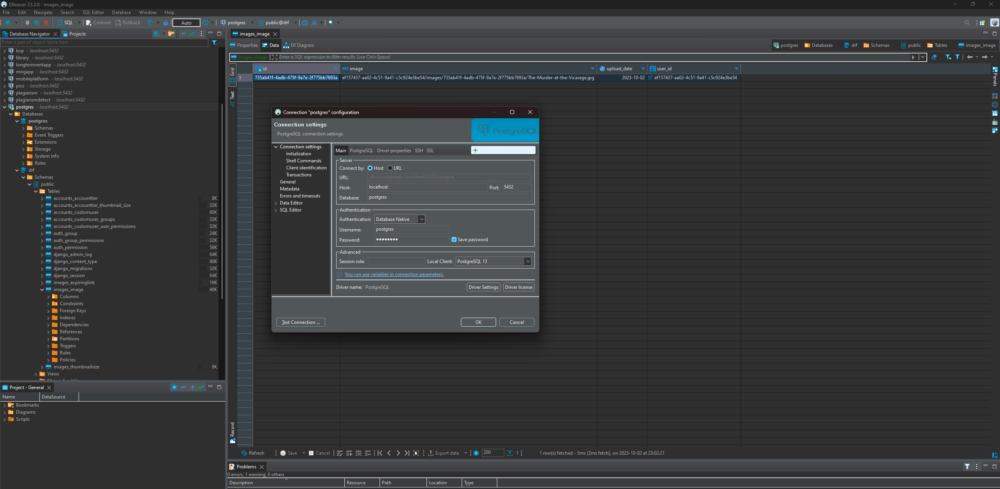
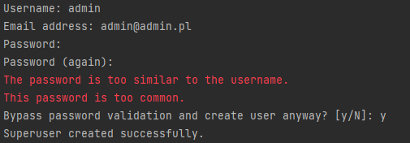
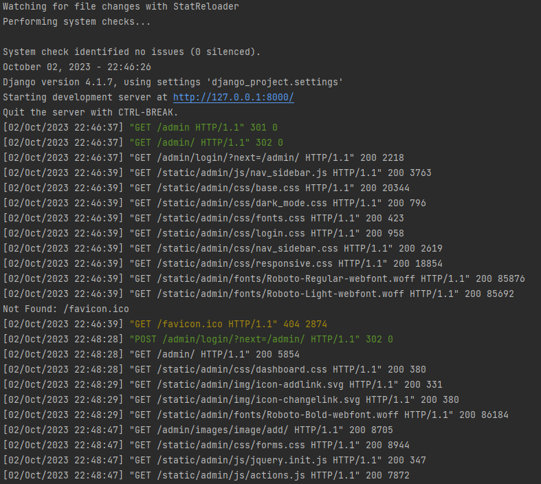
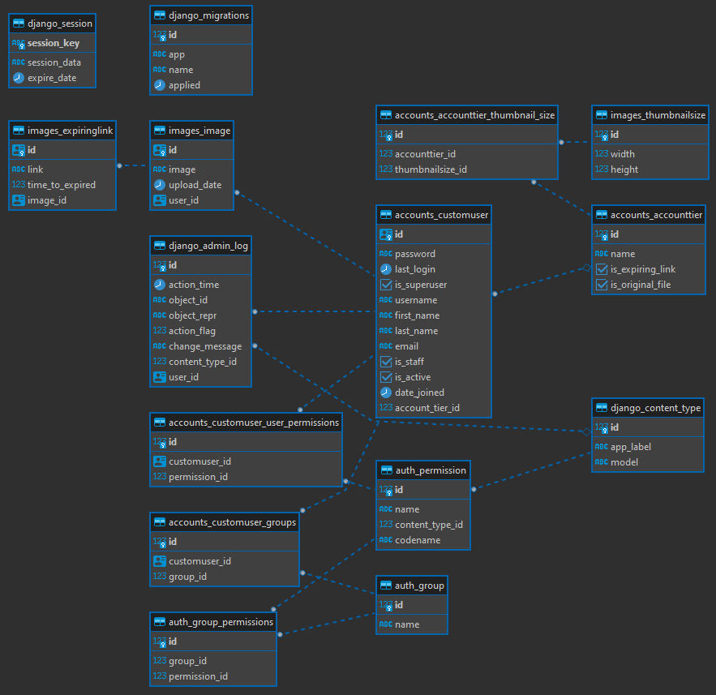
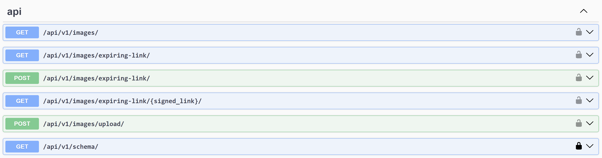

# pics

The pics app is the small service that gives the Customer the possibility to manage the pictures uploaded to the system
according to the tier.

# Project Setup

Please perform the following the steps to setup the project:

1. clone the project
2. setup the local PostgreSQL database



3. setup the DATABASES in the `settings.py` and provide proper values of NAME/USER/PASSWORD:
    ```json
    DATABASES = {
        'default': {
            'ENGINE': 'django.db.backends.postgresql',
            'NAME': 'drf',
            'USER': 'postgres',
            'PASSWORD': 'admin123',
            'HOST': 'localhost',
            'PORT': ''
        }
    }
    ```
4. run the migration with the command `python manage.py migrate`
5. run createsuperuser with the command `python manage.py createsuperuser`



6. run the server with the command `python manage.py runserver`



7. open the browser using the URL: `http://127.0.0.1:8000/admin/`

# Project Documentation

## Functional Specification

- available only for logged-in users
- users should be able to upload images via HTTP request
- users should be able to list their images
- there are three builtin account tiers: Basic, Premium and Enterprise:
    - users that have "Basic" plan after uploading an image get:
        - a link to a thumbnail that's 200px in height
    - users that have "Premium" plan get:
        - a link to a thumbnail that's 200px in height
        - a link to a thumbnail that's 300px in height
        - a link to the originally uploaded image
    - users that have "Enterprise" plan get
        - a link to a thumbnail that's 200px in height
        - a link to a thumbnail that's 300px in height
        - a link to the originally uploaded image
        - ability to fetch an expiring link to the image (the link expires after a given number of seconds (the user can
          specify any number between 300 and 30000))
- apart from the builtin tiers, admins should be able to create arbitrary tiers with the following things configurable:
  - arbitrary thumbnail sizes
  - presence of the link to the originally uploaded file
  - ability to generate expiring links
- admin UI should be done via django-admin
- there should be no custom user UI (just browsable API from Django Rest Framework)

## Database ERD Diagram



## API Specification



# Contact Information

👨 Paweł Dorużyński

☎ +48 530 483 006

📫 pawel.doruzynski@gmail.com 